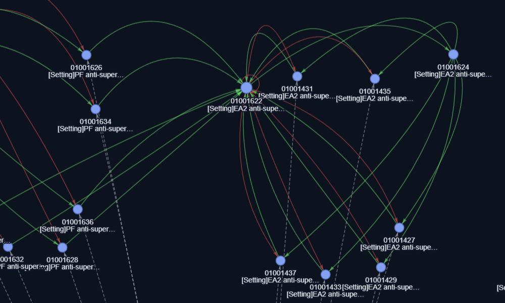
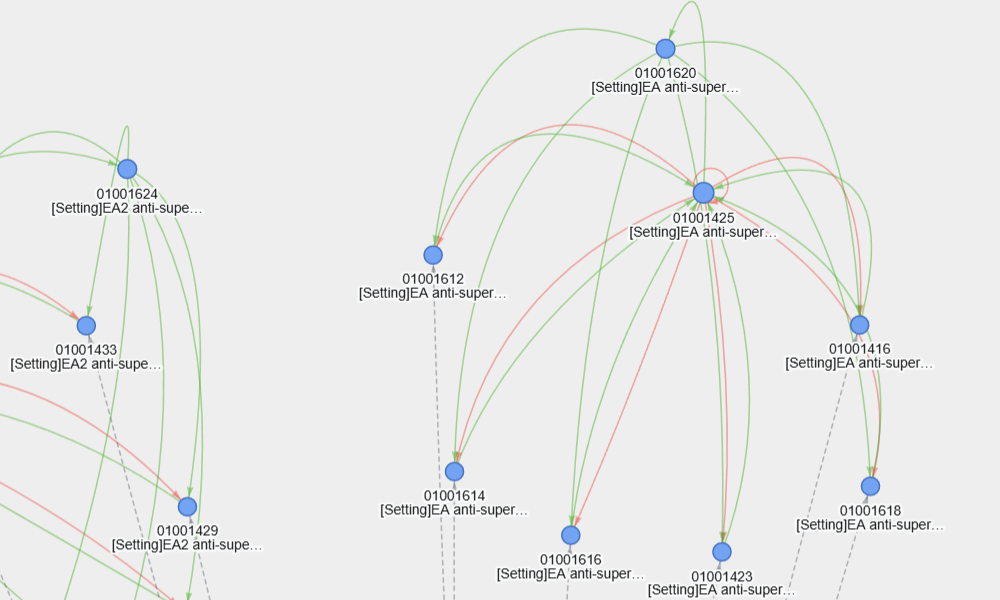
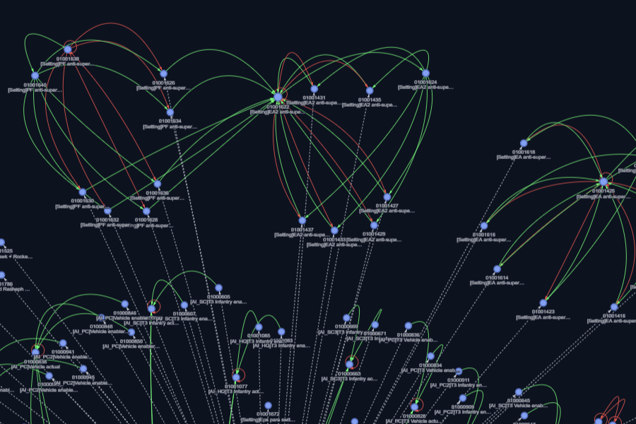
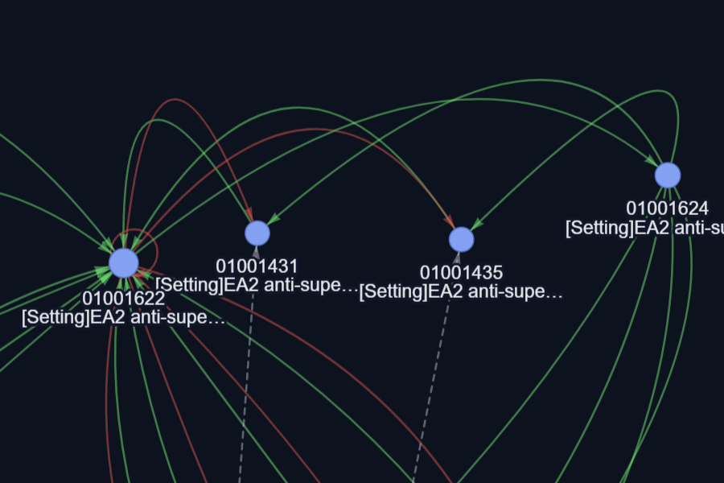
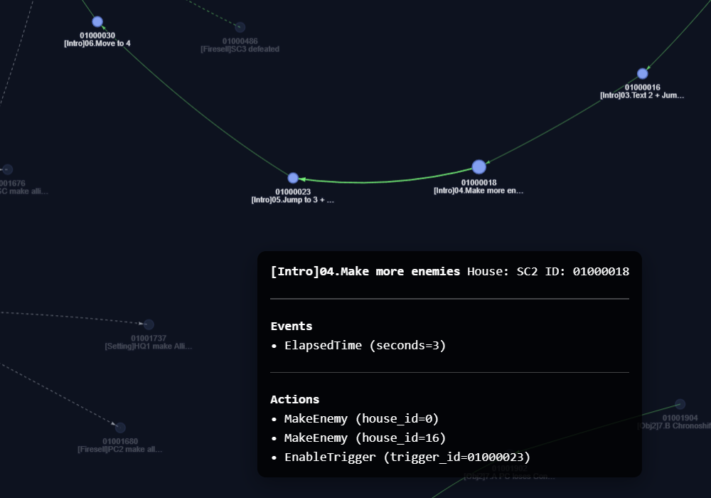
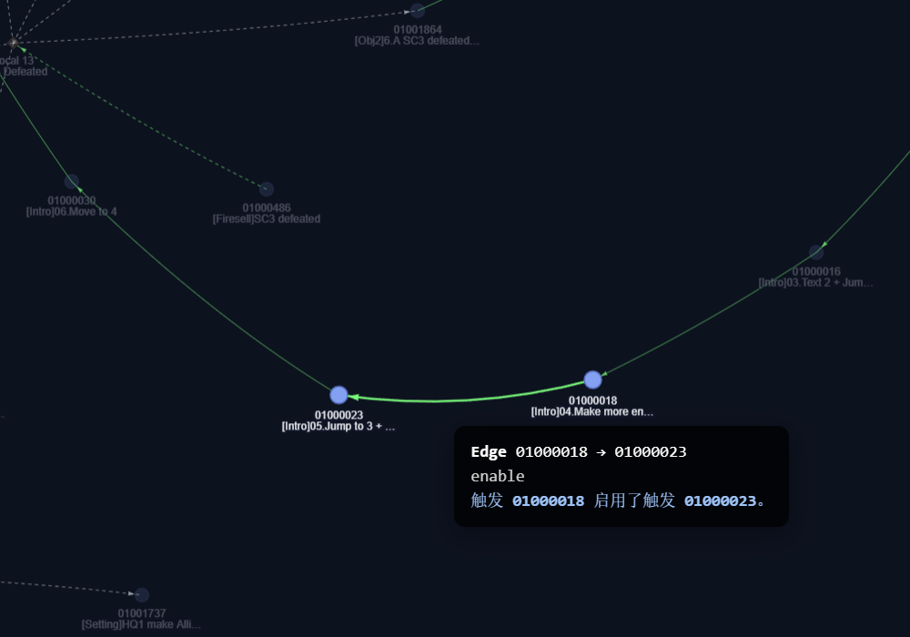

# 🧩 Mental Omega Map Trigger Visualizer  
**Mental Omega Map Trigger Visualizer** 可以将 *Command & Conquer: Mental Omega* 地图文件中的触发逻辑转化为交互式的可视化网络图。  


[](https://www.python.org/)  
[](LICENSE)  
[](https://pyvis.readthedocs.io/)  
[](https://visjs.org/)

---

## ✨ 主要特性

### 🕸️ 1. 触发网络可视化
- 将各个触发以及局部变量读取并生成为“结点”
- 自动识别触发间的连接关系，具体而言，若一个触发：
  - 具有关联触发；
  - 行为为12、22、53或54（销毁/强制/启用/禁用触发）；
- 则会将它们与相应的触发连接。
- 同时，若一个触发：
  - 条件为36或37（局部变量为真/假）;
  - 行为为56或57（将局部变量置为真/假）；
- 则会将它们与相应的局部变量连接。
- 一个结点连接的其他结点数量越多，它的体积会相应增大以示强调；
- 连线使用不同颜色区分逻辑关系，例如（以下仅为部分示例）：  
  | 类型         | 含义    | 颜色  |
  |--------------|---------|------|
  | `enable`     | 启用触发 |  |
  | `disable`    | 禁用触发 |  |
  | `destroy`    | 销毁触发 |  |
  | `force`      | 强制触发 |  |
  | `linked`     | 关联触发 |  |

#### 触发网络总览（默认采用深色主题）


---

### 🌗 2. 深浅主题 + 动态描边
- 可生成深色或浅色主题的网络图，连线的颜色相应切换；  
- 结点标签的字体颜色和描边颜色做了配套，以确保复杂网络中的可读性；
- 对于不同的缩放倍率，会动态调整连线和标签的透明度：
  - 缩放越小越不透明，便于总览全局；
  - 缩放越大越透明，便于详细观察。
- 可自行按需细调配色方案。

#### 深浅主题对比
| 深色主题 | 浅色主题 |
|-----------|-----------|
|  |  |

#### 不同缩放倍率下的能见度
| 远视距 | 近视距 |
|--------|--------|
|  |  |

---

### 🔍 3. 智能高亮系统
- 约定：从一个结点连接出去的箭头称作正向，连接至该结点的箭头称作反向；
- 选中结点时，会：
  - 高亮该结点，以及正向最多两跳，反向一跳的相邻结点，淡化其他部分；
  - 高亮所有正向连线，淡化其他部分。采取这种方案，可以：
    - 方便地辨认出触发/局部变量的“发展方向”；
    - 区别它们是被依赖，还是依赖于其他触发/局部变量；
  - 以悬浮窗显示其信息，包括：
    - 结点为触发时：触发ID、名字、所属方、条件和结果，条件和结果的参数也会一同显示；
    - 结点为变量时：变量ID、名字和初始值。
- 选中连线时，会：
  - 高亮该连线与两端结点；  
  - 以悬浮窗显示其信息，包括：
    - 起止的结点；
    - 表示的依赖关系。
- 悬浮窗将：
  - 在缩放时，自动重定位到被选中的结点/连线上，方便定位被选中的项目；
  - 在拖动时，保持相对屏幕的位置不变，方便改变高亮项目和标签的相对位置，以免遮挡。
 
#### 高亮效果示例
| 点击节点 | 点击边 |
|-----------|-----------|
|  |  |

---
### 💬 4. 小贴士
- 程序只能根据上文提到的触发条件/行为确定结点之间的联系，因此你也许需要改变触发编写习惯，以充分利用本程序的功能，例如：
  - 你想编写三个触发，它们各自相差10秒生效，于是有两种方案：
    - A：三个触发都初始启用，触发1立刻生效，触发2延时10秒生效，触发3延时20秒生效；
    - B：触发1初始启用且立刻生效，触发2和3初始禁用，都会在启用10秒后生效，通过53号行为依次启用；
  - 两种方案在游戏中没有差别，但是在本程序中，A方案下的触发是不会被连接的。

---

### 🤖 5. 自动解析与集成
- 对于新导入的地图，会自动将其局部变量/触发/条件/行为读取并保存为 JSON 文档，再从文档中读取数据画图，无需额外操作。   

---

## 📂 目录结构
```
📁 project_root
│
├── start_client.bat                # 启动客户端
├── config.yml                      # 可选用户配置文件
│
├── data/
│   ├── dicts/
│   │   ├── merge_actions.py        # 用于整合触发行为至同一个 YML 文档
│   │   ├── actions_000_049.yml     # 包含了原版游戏中的0-49号触发行为
│   │   ├── actions_050_100.yml     # 包含了原版游戏中的50-100号触发行为 
│   │   ├── actions_101_145.yml     # 包含了原版游戏中的101-145号触发行为
│   │   ├── actions_ares.yml        # 包含了 Ares 平台引入的触发行为    
│   │   ├── merge_conditions.py     # 用于整合触发条件至同一个 YML 文档
│   │   ├── conditions_000_62.yml   # 包含了原版游戏中的0-62号触发条件
│   │   ├── conditions_ares.yml     # 包含了 Ares 平台引入的触发条件
│   │   └── merged/
│   │       ├── actions_all.yml     # 合并完成后的触发行为文档
│   │       ├── actions_merge.log   # 合并完成后的触发行为文档
│   │       ├── conditions_all.yml  # 合并完成后的触发行为文档
│   │       └── conditons_merge.log # 合并触发行为时的日志
│   ├── maps/                       # 会在首次运行后自动创建
│   │   └── <mapname>/              # 绘制触发网络图需要的全部信息会被存放在该目录下
│   └── tools/                      
│       ├── visualize_triggers.py   # 主可视化脚本
│       ├── map_parser.py           # 地图解析器
│       ├── trigger_http_server.py  # HTTP 服务器
│       └── open_trigger_graphs.py  # 客户端本身
│
├── assets/                         # 包含 GitHub 页面中的预览图
│   ├── overview.png
│   ├── theme_dark.png
│   ├── theme_light.png
│   ├── opacity_far.png
│   ├── opacity_close.png
│   ├── highlight_node.png
│   └── highlight_edge.png
│
├── CHANGELOG.md
├── README.md
└── requirements.txt
```

---

## 🧠 核心逻辑

| 模块 | 功能 |
|------|------|
| **map_parser.py** | 解析 `.map` 文件，生成触发、条件和行为的 JSON 数据 |
| **visualize_triggers.py** | 将数据结构化为图形节点与连线 |
| **_append_custom_js()** | 注入前端交互逻辑（高亮、悬浮窗、缩放 HUD 等） |
| **config.yml** | 用户参数定义与可调配置 |
| **PyVis / Vis.js** | 前端图形渲染与动画 |

---

## ⚙️ 环境配置
1. 可在根目录下 `config.yml` 调整主题色等内容（以下仅为部分示例）：
```yaml
ui:
  theme: dark                       # 可调：主题 dark | light
  bg_color_dark:    "#0b1220"       # 可调：dark 主题下的背景/文字基色
  font_color_dark:  "#e6e8eb"
  bg_color_light:   "#eeeeee"       # 可调：light 主题下的背景/文字基色
  font_color_light: "#111111"

edges:
  dark:                             # 可调：dark 主题下连线的颜色代码
    enable:           "#40ff66"     # 启用触发
    disable:          "#ff4a4a"     # 停用触发
    destroy:          "#9fb1c8"     # 销毁触发
    force:            "#64a0ff"     # 强制触发
    enable_local:     "#40ff66"     # 变量置真
    disable_local:    "#ff4a4a"     # 变量置假
    depends_on_true:  "#bfc6d2"     # 变量为真
    depends_on_false: "#bfc6d2"     # 变量为假
    depends_on:       "#bfc6d2"     # 依赖变量（兜底）
    linked:           "#ff7fc3"     # 关联触发
```

注意：在修改了 `config` 后，需要重新生成网络图才能反映变化。

2. 若需要扩充触发行为（譬如你想添加 Phobos 平台的新内容），可以如下操作：
   - 在 `./data/dicts/` 目录下新建 `actions_*.yml` 文件（星号替换为你喜欢的文字，注意下划线不能少！），仿照已有文件的格式填写内容；
   - 也可以在已有的文件中新增内容，但是不太推荐，万一我以后更新了，这种方式新增的内容就会被覆盖掉；
   - 完成后，在命令提示符，或者文件资源管理器显示路径的文本框中运行：
   ```bash
   python merge_actions.py
   ```
   - 程序会自动将内容整合好，若有重复ID的条目会用新的（文件名字母顺序更靠后的）条目替换之前的条目，因此需要给你的文件一个够好的名字，
     日志文件中也会显示程序使用了哪个文件中的哪个条目覆盖了旧内容，如：
   ```log
   [merge_actions] YYYY-MM-DD HH:MM:SS
   Merged actions: 150 entries
   Issues:
    - INFO: [92] overridden: actions_050_100.yml -> actions_ares.yml
    - INFO: [93] overridden: actions_050_100.yml -> actions_ares.yml
   ```
   - 表示92和93号行为被*替换为*了 `action_ares.yml` 中的相应条目。
   
   扩充触发条件的操作同理，不再赘述。

---

## 🚀 使用说明

通过一个简单的客户端用于生成与打开触发图：

- 文件位置：`tools/open_trigger_graphs.py`
- 功能概览：
  - 列出 `data/maps/` 目录内已有的地图条目，并显示每项的状态：
    - 完整 (HTML + sidecar JSONs 都存在)
    - 缺 JSON（缺少 `*_debug.json` / `*_node_details.json`）
    - 缺 HTML（缺少 `*_trigger_graph.html`）
    - 全缺（既缺 HTML 也缺 JSON）
    - 输入编号打开相应的触发网络图
    - 试图打开缺少文件的网络图时，客户端会在根目录下查找同名的 `.map` 文件并自动调用 `visualize_triggers.py` 进行生成，并在成功后自动打开网络图
  - 输入 `g` 以主动查找根目录下所有 `.map` 文件
    - 输入编号生成相应的触发网络图
    - 支持批量生成（输入 `a` 将为所有 `.map` 运行生成）
    - 生成单个文件时会在成功后自动打开，批量生成则不会自动打开

使用示例：

1. 放置 `.map` 文件在根目录下； 

2. 进入客户端：

直接打开 `start_client.bat`，

或者在命令提示符，或者文件资源管理器显示路径的文本框中运行：
```powershell
python tools\open_trigger_graphs.py
```

之后根据客户端中的提示操作即可。

注意：因为直接打开 `.html` 文件可能导致部分数据无法被正确抓取，因此客户端会启动本地 HTTP 服务器打开网络图，请确保网络或本地端口许可。

3. 老版本中：

在命令提示符，或者文件资源管理器显示路径的文本框中运行：
```powershell
# 如果你需要直接用脚本生成单个地图
python tools\visualize_triggers.py --map example
```

的方法同样可用，不过基于前述注意事项，更推荐使用客户端。

（此处的 example 需要改成你自己的地图名！）

---

## 📦 依赖项

运行本项目需要 [Python 本身](https://www.python.org/)，以及以下非标准 Python 库：

| 模块 | 用途说明 |
|------|-----------|
| **PyYAML** (`pyyaml`) | 解析与合并 YAML 文件（用于 conditions/actions 数据） |
| **NetworkX** (`networkx`) | 构建触发器关系图（节点与边结构） |
| **PyVis** (`pyvis`) | 构建可交互的网络图（最终的可交互前端） |

（项目目录下也附有 requirement.txt）

### 快速安装
```bash
pip install pyyaml networkx pyvis
```
或者
```
pip install -r requirements.txt
```

---

## 🧭 开发中功能
- 暂且不做任何承诺。

---

## 🧩 最新更新

[查看完整更新目录](CHANGELOG.md)

## [1.4.0] - 2025-11-27

### Added
- 实装了缓存功能。
  - 现在在首次打开一张触发网络图并完成物理迭代后，结点的布局会被放入 `data/maps/<map_name>/<map_name>_layout.json` 文件中。
  - 之后打开同一触发网络图时，便可以直接根据缓存文件迅速还原结点布局。
  - 在客户端中重新生成网络图时，会将缓存文件**清除**以免过时的缓存导致显示出错。
  - 为了支持这一功能，新增了 `tools/trigger_http_server.py` 文件。

### Improved
- 改进了客户端的列表显示，现在它会分开显示 `(JSON完整性)`、`（生成版本号）`、`（有无缓存）` 了。
  - 形如 `[0] aanes: aanes_trigger_graph.html (COMPLETE) (v1.4.0) (CACHED)`
- 改进了客户端的交互逻辑，现在在生成已有的地图时，也一定会调用一次 `map_parser.py` 来重新解析触发/条件/行为/局部变量的 `JSON` 文件了。
  - 之前若这些 `JSON` 过时但完整，程序在生成网络图时便不会重新解析，进而无法及时反映地图的更新。
- 改进了客户端的超时处理，现在在等待30秒仍未成功生成网络图时，会终止生成并提示可能是程序出了 bug。

### Fixed
- `稳定进度` 和 `稳定耗时` 可以正确显示了。
- `FPS` 显示真的可以通过 `config.yml` 的同一个选项开关了。

---

## ⚠️ 重大已知问题
- 暂未发现。

---

## 📌 额外
- 项目大部分用AI生成，遇到问题同样交给AI解决应该会更方便。
- 广告：演示用地图文件来自个人作品[麻醉](https://www.bilibili.com/video/BV1pwcre2EDa/)。


--- 

## 📜 许可
本项目采用 [MIT License](LICENSE) 开源协议。  
自由使用、修改与分发，保留署名即可。
